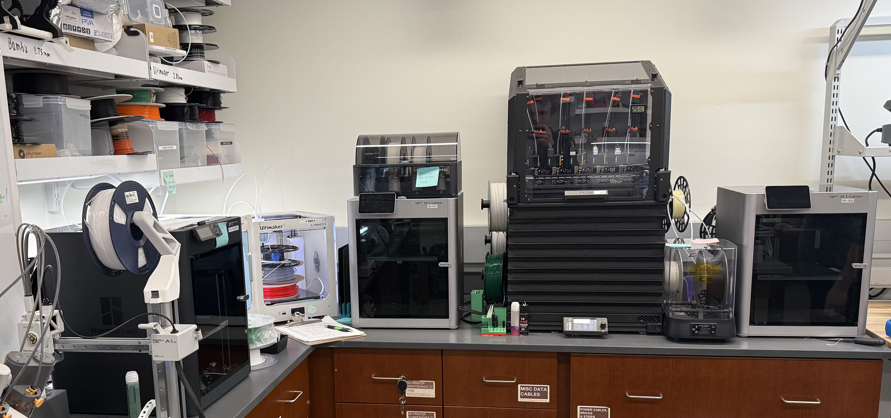
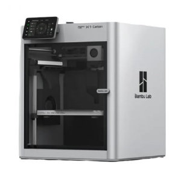
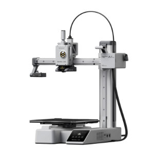
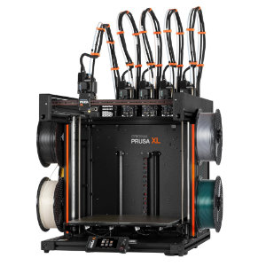

# 3D Printers

The CRB Makerspace has access to several Fused Deposition Modeling (FDM) 3D printers.

{ width = 100% }

## Hazard level

LOW

!!! warning

    - Hot surfaces: nozzle (180-260°C) and heated bed (50-110°C) cause severe burns
    - Moving parts can pinch or crush
    - Risk of inhalation of ultrafine particles and VOCs during printing

## Safety

- **Do not touch hotend.** Print beds and nozzles can exceed 200°C. Always assume hot surfaces until printer indicates it has cooled.
- Keep hands, hair, and clothing away from moving parts. Tie back long hair and secure loose sleeves or jewelry.
- **Use only approved materials.** PLA is the default; other filaments must be approved by staff due to fumes and print settings.
- Ensure that the first layer prints correctly before leaving.
- **Do not use metal tools on print surfaces.** They can damage the finish and affect adhesion. Use the provided plastic tools to remove parts and adhesives as directed.
- If something seems wrong (unusual noises, smoke/odors, spaghetti print), pause the job and notify staff immediately.
- Know how to pause/stop. Familiarize yourself with the emergency stop/pause on the specific printer before starting.
- Remove parts, replace print bed, and tidy up when finished.

## Printers

| Device | Image | Resources |
| --- | --- | --- |
| Bambu Lab X1 Carbon | { width="200" } | [Manual](https://wiki.bambulab.com/en/x1/manual) |
| Bambu Lab P1S | { width="200" } | [Manual](https://wiki.bambulab.com/en/p1/manual) |
| Bambu Lab A1 mini | { width="200" } | [Manual](https://wiki.bambulab.com/en/a1-mini) |
| Original Prusa XL | { width="200" } | [Manual](https://help.prusa3d.com/product/xl) |
| Ultimaker 3 | { width="200" } | [Manual](../manuals/ultimaker-3-manual.pdf) |

## Materials

Parts in the CRB Makerspace are generally printed with PLA, or polylactic acid, which is a versatile, biodegradable plastic derived from renewable resources like corn starch or sugarcane. Other materials are available upon request.

**Do not attempt to change or reload filaments yourself.** Ask for assistance if a change or replacement is needed.

## Guide

- **The clipboard must be filled out for every print job.**
- Ask for assistance for changing filament.
- Long or large prints (3+ hours) must be coordinated with Raphael.
- Remove parts and clean the build surface when your print is done; leave the printer ready for the next user.
- The 3D printers must be started in person. They are not connected to the nextwork (on purpose). Set up the print with the printers software, add the file to a microSD card or USB drive, and start the print on the device. ##Ensure the correct material is selected for use.
- Watch the first layer complete before leaving. Most failures occuer on the first layer.
- Promptly remove prints when complete. **Do not use metal tools to remove parts from the print bed.** Use plastic tools instead to prevent damage to the print surfaces.
- Clean up all pieces and return the print bed in the printer before leaving.

## Report Issue

Button here

<iframe src="https://calendar.google.com/calendar/embed?src=724d65f6eb3dc9f40ef13b9883a210bd3d9845eeaa23a565231e7dc7f97d9f61%40group.calendar.google.com&src=788918014326b46f028cf718f4c77542c0d9d6dde10b40c84e19d506aba04c74%40group.calendar.google.com&mode=WEEK&showTabs=0&showCalendars=0&showTitle=0&bgcolor=%23ffffff" style="border: 0" width="800" height="600" frameborder="0" scrolling="no"></iframe>

<iframe src="/assets/scheduler.html" width="100%" height="780" style="border:0; border-radius:12px;"></iframe>