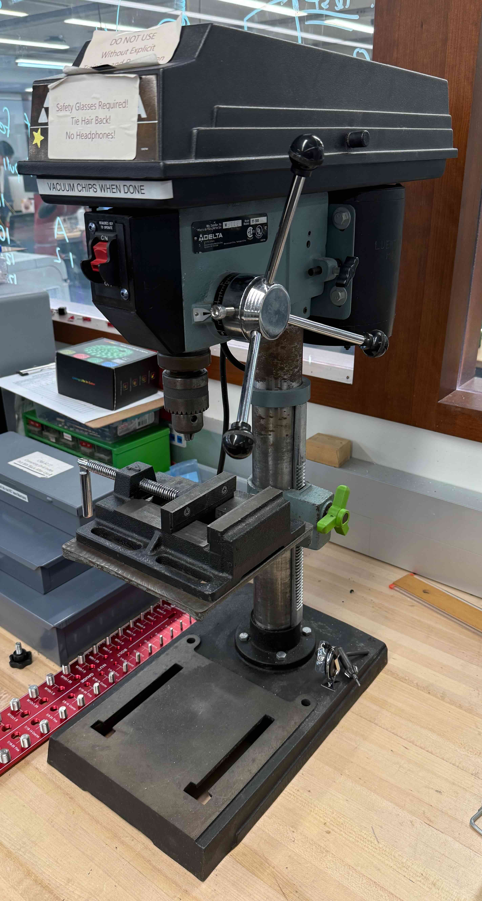

# Drill Press

The CRB Makerspace has a Delta 11-980 8" drill press.

{ width="300" }

## Hazard level

HIGH

!!! warning

    - Rotating chuck and drill bit can entangle hair, clothing, or jewelry
    - Risk of flying chips and broken drill bits
    - Risk of workpiece ejection if not secured
    - Chuck key left in chuck becomes projectile

## Safety

- Always wear safety glasses.
- Workpieces must always be secured.
- Do not wear gloves, neckties, loose clothing, or jewelry.
- Keep fingers safe distance from blade.

## Instructions for use

!!! info
    
    Use of this tool requires permission from management and a key to operate. Check out the key from Raphael or authorized personnel before use and return it immediately after.

!!! failure "Do not cut steel in the CRB Makerspace"

Wait for the machine to come to a complete stop.

- Always use eye protection.
- Request the key from the lab manager and unlock the device.
- Raise the bow and secure it in an elevated position using the support plate.
- Position your workpiece in vise and tighten the vise. Ensure the piece is held tightly in place.
- Release the support plate and turn on the saw by holding the green button. **Do not start the saw with the blade touching the workpiece.**
- Let the weight of the bow in conjunction with the spring tension cut through the workpiece. Do not apply additional pressure.
- The saw will turn off when the cut is complete.
- Reattach the lock to the green button and return the key.
- Clean up your workspace.

## Manual

!!! info
    
    This manual is for a Delta 11-950 instead of the 11-980, but they appear to be almost the same.

<iframe
    src="../manuals/delta-11-950-manual.pdf"
    width="100%"
    height="1100px"
    style="border:none;"
></iframe>