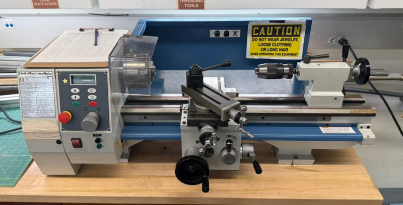

# Mini Lathe

{ width="600" }

The CRB Makerspace Shop has a Model 3540 HiTorque Bench Lathe for basic turning operations. You must complete machine-specific training before being authorized to use this machine. **Do not cut steel on this machine.**

## Hazard level

HIGH

!!! warning

    - Risk of severe entanglement with rotating workpiece or chuck
    - Flying chips and metal shavings can be hot and sharp
    - Risk of ejection of improperly secured workpiece
    - Risk of cuts from sharp tools and workpiece edges
    - Chuck key left in chuck becomes projectile

## Safety

- Use common sense. Think through the results of your actions before you act.
- Understand the operation of the machine. Do not operate the machine if you do not know what is going to happen.
- Learn, don’t experiment. Study, understand, and do things where you have a clear expectation of the outcome. Don’t “see what will happen.”
- Don’t attempt jobs that are beyond the capacity of a tabletop lathe.
- Check the work piece after you place it in the chuck or other work holding device. Be sure it is secure before turning on the lathe.
- Don’t wear loose clothing or jewelry when operating the lathe.
- Stop the spindle and make sure the machine is in a safe condition before:
    - Opening or removing safety shields
    - Reaching into work area
    - Changing or adjusting tools
    - Changing or adjusting work pieces
    - Changing speed ranges
    - Clearing chips or coolant
- Inspect cutting tools for sharpness, chips, and cracks before each use. Replace dull, chipped, or cracked cutting tools immediately.
- Handle cutting tools with care. Cutting edges are very sharp and can cause lacerations.
- Do not use unbalanced work pieces or fixtures in the spindle
- Remove all tools (wrenches, chuck keys, locking pins, and so on) from the spindle immediately after using them.
- Use caution when using liquids and electricity. Ensure that coolants and lubricants are kept away from high voltage electrical components.
- Keep bystanders, children, and visitors a safe distance away while operating any power tool.
- Read the manual. Know the operation of every control before you attempt any operation of the machine.
- Make sure that all guards are in place and functioning before operating the machine.
- Check for damage and abnormal wear before operating the machine.
- Always wear safety glasses (side shields are recommended) that are ANSI Z87.1-2003 compliant.
- Wear hearing protection (ear plugs or ear muffs) when operating loud machines.
- Wear appropriate clothing; no rings, gloves, neckties, jewelry, or loose-fitting garments. Bind long hair or wear a hat.
- Do not use compressed air for cleaning machines. A shop vacuum works well and is much safer.
- Maintain a clean and uncluttered work area.
- Avoid pinch points.
- Never leave a running machine unattended.
- Do not force or overload machinery.
- Use appropriate cutting tools with appropriate feeds and speed.
- Cutting tools get hot during use and can cause burns if handled inappropriately.
- Do not attempt to use work pieces that are too large or too heavy for the
machine.
- Clear chips with a brush or other tool, never with your hands or with compressed air.
- Clamp work securely. Cutting forces are significant and can turn work pieces that are not secured into projectiles.

## Cutting Speeds

https://littlemachineshop.com/Reference/CuttingSpeeds.php#Turning

## Manual

<iframe
    src="../manuals/hitorque-bench-lathe-users-guide.pdf"
    width="100%"
    height="1100px"
    style="border:none;"
></iframe>